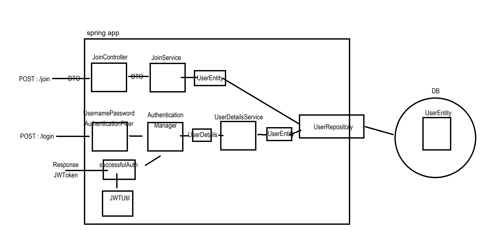
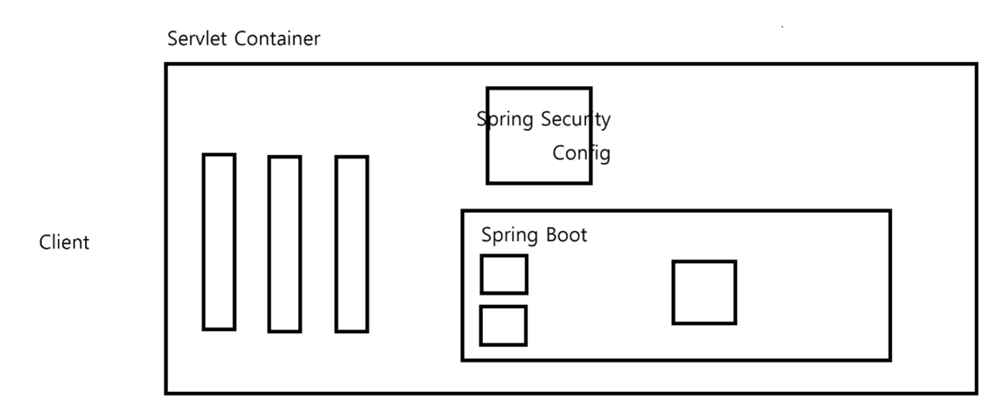

# Basic Spring Security JWT lesson
[Youtube 강의 주소](https://www.youtube.com/watch?v=NPRh2v7PTZg&list=PLJkjrxxiBSFCcOjy0AAVGNtIa08VLk1EJ)

### Lecture Documentations
[Spring Security JWT](https://substantial-park-a17.notion.site/JWT-7a5cd1cf278a407fae9f35166da5ab03)

### Notes

1, 2강 기억해야할 사항 없음.

* SecurityConfig class 참조

#### 전체 구현 흐름도

* Spring Security를 의존성에 추가하면 /login 으로 들어오는 요청은 UsernamePasswordAuthenticationFilter 필터에서 처리해야하고
  이 필터를 구현해야한다. 자세한 내용은 LoginFilter class 볼 것

### 스프링 시큐리티 필터 동작 원리
* 스프링 시큐리티는 클라이언트의 요청이 여러개의 필터를 거쳐 DispatcherServlet(Controller)으로 향하는 중간 필터에서 요청을 가로챈 후 검증(인증/인가)을 진행한다.
  

* Delegating Filter Proxy
  서블릿 컨테이너 (톰캣)에 존재하는 필터 체인에 DelegatingFilter를 등록한 뒤 모든 요청을 가로챈다.

* 서블릿 필터 체인의 DelegatingFilter → Security 필터 체인 (내부 처리 후) → 서블릿 필터 체인의 DelegatingFilter  
  가로챈 요청은 SecurityFilterChain에서 처리 후 상황에 따른 거부, 리디렉션, 서블릿으로 요청 전달을 진행한다.

* SecurityFilterChain의 필터 목록과 순서

* Form 로그인 방식에서 UsernamePasswordAuthenticationFilter  

Form 로그인 방식에서는 클라이언트단이 username과 password를 전송한 뒤 Security 필터를 통과하는데 UsernamePasswordAuthentication 필터에서 회원 검증을 진행을 시작한다.

(회원 검증의 경우 UsernamePasswordAuthenticationFilter가 호출한 AuthenticationManager를 통해 진행하며 DB에서 조회한 데이터를 UserDetailsService를 통해 받음)

우리의 JWT 프로젝트는 SecurityConfig에서 formLogin 방식을 disable 했기 때문에 기본적으로 활성화 되어 있는 해당 필터는 동작하지 않는다.

따라서 로그인을 진행하기 위해서 필터를 커스텀하여 등록해야 한다.

* UserDetailsService 커스텀 구현  
  CustomUserDetailsService.java 보기
* UserDetails 커스텀 구현  
  CustomUserDetails.java 보기

